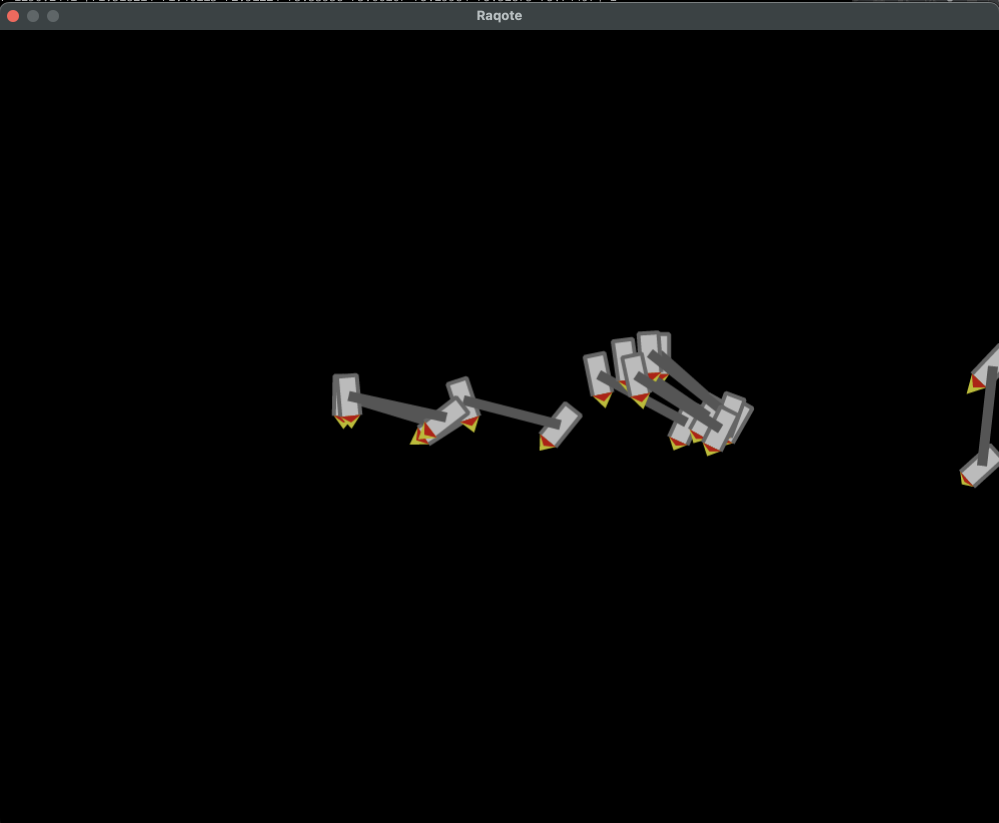

# Physics rocket

This is a project where neural net controls a 2d rocket that tries to follow the mouse and stay still.

Inspired by my other projects:

https://github.com/superosku/car-neural

and

https://github.com/superosku/car-evolution

and this youtube video:
https://www.youtube.com/watch?v=hQ4ryudP4j8

Right now it does not work that well. Improvements are needed.

Screenshot:

